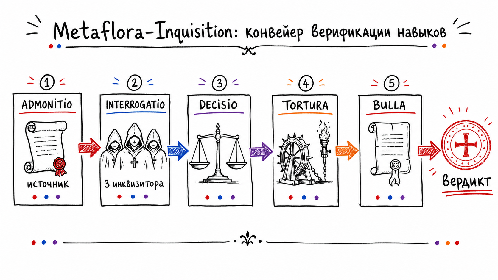
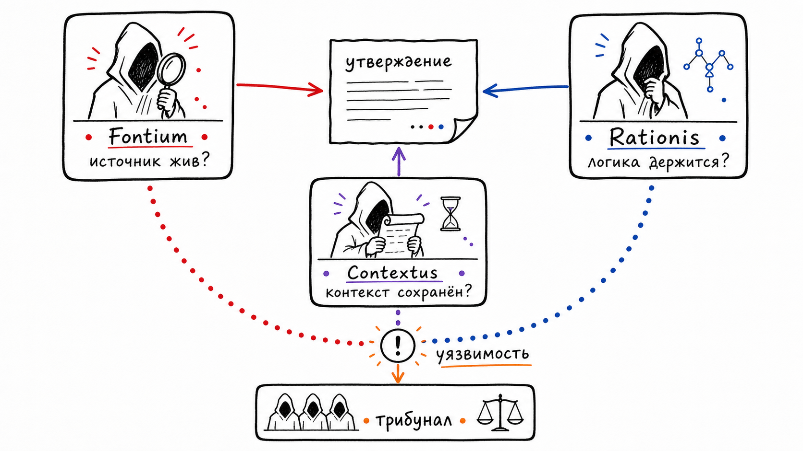
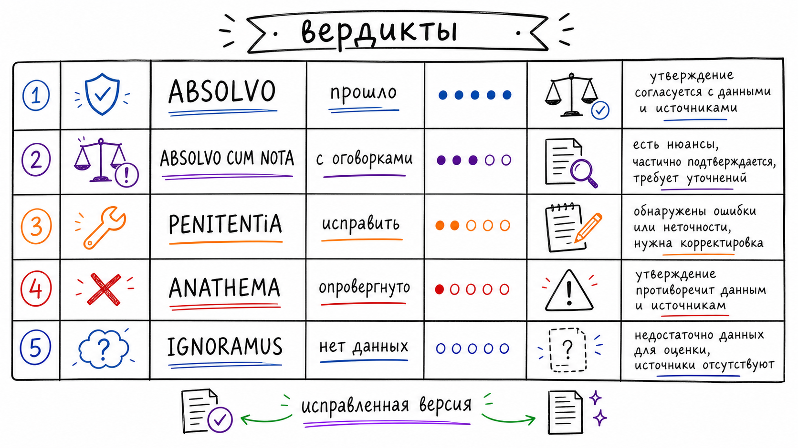

# Metaflora Inquisition

> Скилл для проверки утверждений под давлением: источник, логика, контекст, точка разлома и финальная булла.



**Metaflora Inquisition** превращает расплывчатое "проверь, правда ли это" в жёсткий верификационный процесс. Он не ищет подтверждение тезису. Он заставляет утверждение пройти трибунал: сначала установить происхождение, затем атаковать его с трёх независимых сторон, при необходимости назначить точечную пытку и в конце выдать буллу с вердиктом.

Скилл нужен для фактов, статистики, цитат, продуктовых сравнений, решений на данных, отчётов других AI и любых тезисов, где цена ошибки выше обычной болтовни.

## Что внутри

- `skills/metaflora-inquisition/SKILL.md` — исходный skill-файл.
- `dist/metaflora-inquisition.skill` — готовый `.skill`-пакет для установки.
- `assets/` — три скетчноута для README, релиза и постов.
- `docs/release-notes.md` — подробное описание релиза.
- `docs/install.md` — варианты установки.
- `docs/github-release-body.md` — готовый текст для GitHub Releases.
- `docs/checksums.txt` — SHA-256 для проверки артефактов.

## Как это работает

Процесс состоит из пяти частей:

1. `ADMONITIO` — мягкое установление происхождения тезиса: кто сказал, где опубликовано, на каких данных стоит, кому выгодно.
2. `INTERROGATIO` — три независимых инквизитора проверяют тезис параллельно:
   - `Fontium` смотрит на источники;
   - `Rationis` смотрит на логику;
   - `Contextus` смотрит на контекст и применимость.
3. `DECISIO TRIBUNALIS` — трибунал решает, хватает ли данных для вердикта или нужна точечная атака.
4. `TORTURA` — два адвоката атакуют и защищают одну конкретную точку разлома.
5. `BULLA INQUISITIONIS` — финальный документ с вердиктом, оговорками, исправленной версией и уровнем доверия к источникам.



## Вердикты

Скилл всегда заканчивает работу одним из пяти вердиктов:

- `ABSOLVO` — утверждение прошло проверку.
- `ABSOLVO CUM NOTA` — верно, но с существенными оговорками.
- `PENITENTIA` — частично верно, требует исправления.
- `ANATHEMA` — галлюцинация или прямое искажение.
- `IGNORAMUS` — установить невозможно.

При `PENITENTIA` и `ANATHEMA` скилл обязан дать исправленную версию утверждения. Ценность не только в том, чтобы разрушить плохой тезис, а в том, чтобы оставить после проверки корректную формулировку.



## Когда запускать

Запускай скилл, когда пользователь пишет:

- `/inquisition`
- `инквизиция`
- `допроси это`
- `проверь под давлением`
- `это правда?`
- `перепроверь`
- `я не уверен в этом`
- `fact-check`
- `проверь факт`
- `убедись`

Также скилл подходит для любого утверждения, которое нужно верифицировать: цифры, цитаты, исследования, заявления конкурентов, сравнения моделей, результаты другого AI, прогнозы и планы на данных.

## Установка

### Вариант 1: `.skill`-пакет

Используй готовый архив:

```bash
open dist/metaflora-inquisition.skill
```

Или попроси агента установить пакет:

```text
Установи этот skill-пакет: dist/metaflora-inquisition.skill
```

### Вариант 2: вручную

Скопируй директорию скилла:

```bash
mkdir -p ~/.codex/skills/metaflora-inquisition
cp skills/metaflora-inquisition/SKILL.md ~/.codex/skills/metaflora-inquisition/SKILL.md
```

После установки открой новый чат и напиши:

```text
/inquisition: Reels с субтитрами получают на 40% больше охвата
```

## Пример запроса

```text
инквизиция: Claude лучше GPT-4o для кодинга
```

Ожидаемый результат — не короткое "да/нет", а булла:

- происхождение утверждения;
- выводы Fontium, Rationis и Contextus;
- решение о Tortura;
- финальный вердикт;
- исправленная версия при необходимости;
- список проверенных источников;
- уровень доверия.

## Релиз

Текущий пакет: `v0.1.0`.

Главная цель релиза — вынести процедуру fact-checking в отдельный переносимый skill, который можно использовать в Codex, Claude Code и других skill-aware harnesses без привязки к конкретному проекту.

## Проверка

```bash
npm test
```

Тест проверяет, что:

- `dist/metaflora-inquisition.skill` существует;
- архив содержит `metaflora-inquisition/SKILL.md`;
- skill имеет имя `metaflora-inquisition`;
- в тексте есть все ключевые стадии и пять вердиктов;
- три скетчноута лежат в `assets/`.

